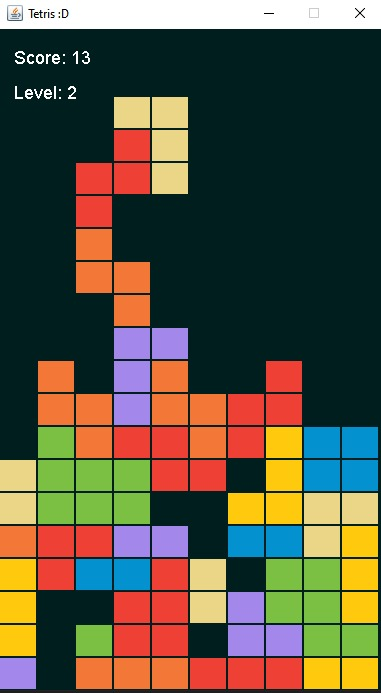

# Tetris

Tetris é um clássico jogo de quebra-cabeças no qual os jogadores movem e giram peças chamadas Tetrominos para completar linhas no tabuleiro. Este jogo foi implementado em Java para proporcionar uma experiência nostálgica e divertida.

# Captura de Tela do Jogo em Execução:

- **No Windows**  

# Como Jogar

1) Compile os arquivos java com o seguinte comando: javac -d bin Tetris/*.java
2) Execute o programa, utilizando o comando: java -cp bin game.tetris.RunApp
3) Controle as peças (Tetrominos) usando as teclas do teclado:
   - **Seta para a Esquerda (←):** Move o Tetromino para a esquerda.
   - **Seta para a Direita (→):** Move o Tetromino para a direita.
   - **Seta para Cima (↑):** Rotaciona o Tetromino.
   - **Seta para Baixo (↓):** Faz o Tetromino descer mais rapidamente.
   - **Barra de Espaço:** Faz o Tetromino descer diretamente até o final.
4) Complete linhas horizontais no tabuleiro para ganhar pontos.
5) Alcançar **10 pontos** permite avançar para o próximo nível.
   - Por exemplo:
     - **Nível 1 → Nível 2:** 10 pontos.
     - **Nível 2 → Nível 3:** 20 pontos, e assim por diante.
6) O jogo termina quando os Tetrominos alcançam o topo do tabuleiro.
7) Escolha se deseja jogar novamente ou encerrar.

# Requisitos

- [Java] Ambiente de desenvolvimento que suporte Java 8 ou superior.
- Sistema operacional compatível com a execução de programas Java.